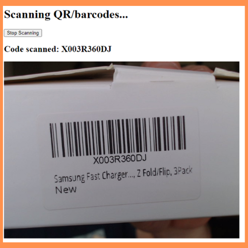

# react-barcode-reader



React Barcode Reader is a simple mockup project demonstrating how to use the Zebra Crossing (ZXing) image processing library in a React project. This project aims to showcase a basic implementation of barcode reading capabilities within a web application using React and the ZXing library.

## Table of Contents

- [Introduction](#introduction)
- [Features](#features)
- [Installation](#installation)
- [Usage](#usage)
- [Dependencies](#dependencies)
- [Contributing](#contributing)
- [License](#license)

## Introduction

Barcode reading is a common requirement in various applications such as inventory management, hospitals, retail, ticketing, and more. The Zebra Crossing (ZXing) library is an open-source image processing library that supports reading various types of barcodes like QR codes, UPC codes, and more. This project provides a simple React application that integrates the ZXing library to read barcodes from images or live camera input.

## Features

- Scan barcodes from webcam
- Display barcode text on the screen
- Simple and easy-to-understand React codebase
- Utilizes the power of ZXing image processing library

## Installation

1. Clone the repository:

```bash
git clone https://github.com/drchaney/react-barcode-reader.git
cd react-barcode-reader
```

2. Install the dependencies:

```bash
npm install
```

## Usage

1. Start the development server:

```bash
npm start
```

2. Open your web browser and navigate to `http://localhost:3000` to access the React Barcode Reader application.

3. To scan barcodes using the live camera, click on the "Start Scanning" button. Grant necessary camera permissions if prompted. Point the camera towards a barcode, and the application will read and display the barcode information in real-time.  Click "Stop Scanning" to turn off your camera.

## Dependencies

The project relies on the following main dependencies:

- React: A JavaScript library for building user interfaces.
- ZXing: An open-source, multi-format 1D/2D barcode image processing library.

For the full list of dependencies, please refer to the `package.json` file.

## Contributing

I welcome contributions to enhance the functionality or fix any issues in the project! If you'd like to contribute, please follow these steps:

1. Fork the repository.

2. Create a new branch for your feature or bug fix:

```bash
git checkout -b feature/your-feature-name
```

3. Make your modifications and commit them:

```bash
git commit -m "Add your commit message here"
```

4. Push your branch to your forked repository:

```bash
git push origin feature/your-feature-name
```

5. Open a pull request on the original repository, explaining your changes and why they should be merged.

## License

This project is licensed under the [MIT License](LICENSE). Feel free to use, modify, and distribute it as per the terms of the license.

---

Thank you for checking out our React Barcode Reader project! If you have any questions, suggestions, or issues, feel free to raise them in the GitHub repository's issue section. Thanks!